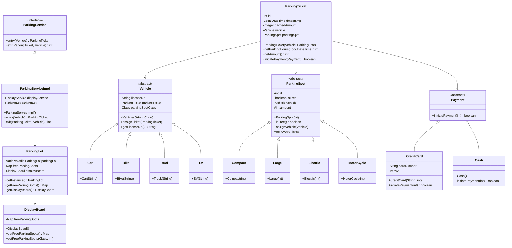

# Parking Lot Management System

A comprehensive parking lot management system built with Java, implementing object-oriented design principles and design patterns with proper separation of concerns.

## Features

- **Multi-vehicle Support**: Cars, Bikes, Trucks, Electric Vehicles
- **Dynamic Spot Allocation**: Compact, Large, Electric, Motorcycle spots
- **Real-time Display**: Available parking spots tracking
- **Payment Processing**: Credit Card and Cash payments
- **Thread-Safe Operations**: Concurrent vehicle entry/exit handling
- **Admin Management**: Parking spot and panel management

## Architecture

### Design Patterns Used
- **Singleton Pattern**: ParkingLot (manages system state)
- **Factory Pattern**: ParkingSpotService for dynamic spot creation using reflection
- **Strategy Pattern**: Payment processing (CreditCard, Cash)
- **Service Layer Pattern**: Separation of business logic from DTOs

### Key Components
- **Vehicle Hierarchy**: Abstract Vehicle with Car, Bike, Truck, EV implementations
- **ParkingSpot Hierarchy**: Abstract ParkingSpot with Compact, Large, Electric, MotorCycle types
- **Service Layer**: ParkingService, DisplayService, ParkingSpotService (business logic)
- **DTO Layer**: ParkingLot, DisplayBoard, ParkingTicket (data containers)
- **Payment System**: Abstract Payment with CreditCard and Cash implementations

## UML Class Diagram




## Security Features

- **Thread-Safe Singleton**: Double-checked locking pattern for ParkingLot
- **Input Validation**: Comprehensive null checks and parameter validation
- **Log Injection Prevention**: Input sanitization for logging
- **Proper Logging**: Java logging framework with structured logging
- **Encapsulation**: Immutable collections returned from getters

## Performance Optimizations

- **Cached Calculations**: Parking fee calculations cached in ParkingTicket
- **Static Initialization**: Reflection operations moved to static blocks
- **Singleton Caching**: Reduced getInstance() calls in services
- **Factory Pattern**: Efficient object creation using reflection

## Architecture Improvements

- **Separation of Concerns**: DTOs contain only data, services handle business logic
- **No Mixed Responsibilities**: DisplayBoard is pure DTO, DisplayService handles updates
- **Proper Error Handling**: Meaningful exceptions instead of silent failures
- **Consistent Naming**: Java conventions followed throughout

## Usage Example

```java
// Initialize parking lot
ParkingLot parkingLot = ParkingLot.getInstance();
ParkingSpotService spotService = new ParkingSpotServiceImpl();

// Create parking spots
ParkingSpot compactSpot = spotService.createParkingSpot(Compact.class, 0);
ParkingSpot electricSpot = spotService.createParkingSpot(Electric.class, 0);

// Vehicle entry
Vehicle car = new Car("ABC-123");
ParkingServiceImpl parkingService = new ParkingServiceImpl();
ParkingTicket ticket = parkingService.entry(car);

// Payment and exit
ticket.initiatePayment(new CreditCard("1234567890123456", 123));
int fee = parkingService.exit(ticket, car);
```

## Project Structure

```
src/main/java/org/deepak/
├── dto/
│   ├── account/          # Account management classes
│   ├── parkingSpot/      # Parking spot implementations
│   ├── payment/          # Payment system
│   ├── vehicle/          # Vehicle types
│   ├── DisplayBoard.java
│   ├── ParkingLot.java
│   └── ParkingTicket.java
├── enums/               # Status enumerations
├── exceptions/          # Custom exceptions
├── interfaces/          # Service interfaces
├── services/           # Service implementations
└── Main.java          # Demo application
```

## Build & Run

```bash
# Compile
javac -cp ".:lib/*" src/main/java/org/deepak/**/*.java

# Run
java -cp ".:lib/*:src/main/java" org.deepak.Main
```

## Dependencies

- Java 8+
- Reflections library for dynamic class scanning
- Java Logging API

## Factory Pattern Implementation

The `ParkingSpotService` implements the Factory Pattern for dynamic object creation:

```java
// Factory creates objects based on Class type
ParkingSpot spot = parkingSpotService.createParkingSpot(Compact.class, floor);

// Uses reflection to instantiate the correct type
ParkingSpot parkingSpot = (ParkingSpot) parkingSpotClass
    .getDeclaredConstructor(int.class)
    .newInstance(floor);
```

**Benefits:**
- **Encapsulation**: Hides object creation complexity
- **Consistency**: Ensures all spots are registered in the system
- **Extensibility**: Easy to add new parking spot types
- **Dynamic Creation**: Uses reflection for flexible instantiation

## Design Principles Applied

- **SOLID Principles**: Single responsibility, Open/closed, Interface segregation
- **Separation of Concerns**: DTOs vs Services clearly separated
- **Encapsulation**: Private fields with controlled access
- **Polymorphism**: Vehicle and ParkingSpot hierarchies
- **Abstraction**: Service interfaces and abstract classes
